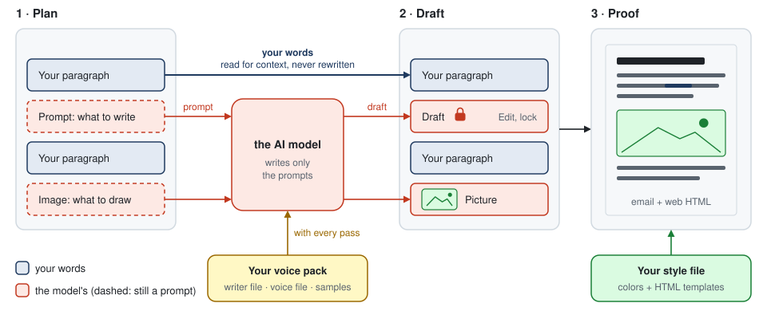
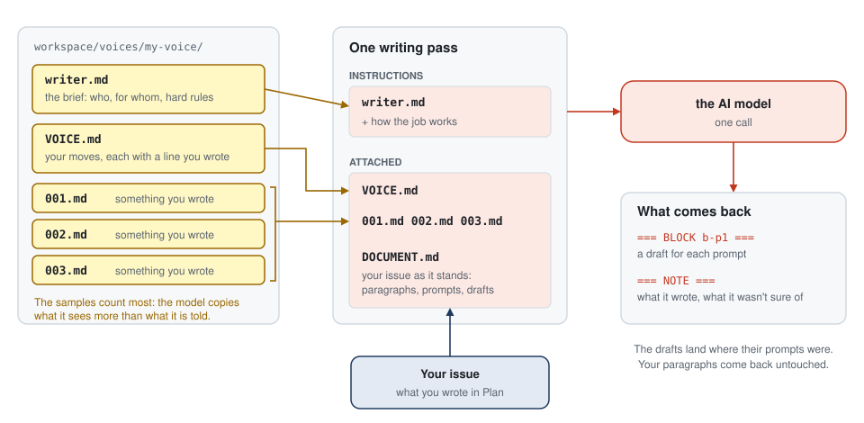
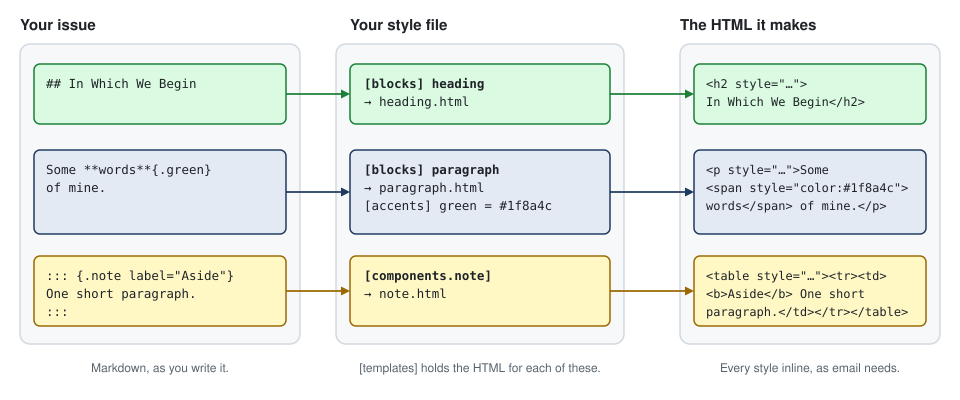

# slopmill

slopmill helps you write with an AI model that sounds like YOU wrote it. I built it for a weekly newsletter, but you can use it for anything you write regularly: blog posts, op-eds, reports, updates for a team, even a story. Your writer file, voice file and writing samples tell the model how you sound. Your colors and HTML templates live in one style file.

You write the parts you care about, leave short prompts for the rest, and fix what the model got wrong. Then you see the issue exactly as your readers will. It runs on your computer, in your browser. Your text goes only to the AI service you pick, using your own API key. When you ask it to research something, the search words also go to a search engine (turn that off with `[research] provider = "off"`).

<picture>
  <source media="(prefers-reduced-motion: reduce)" srcset="docs/media/walkthrough-poster.jpg">
  
</picture>

That's slopmill in two minutes. **[Try the demo](https://demo.slopmill.org/)** to click through it yourself: no account, nothing to install. If you want a pause button, the video is [docs/media/slopmill-walkthrough.mp4](docs/media/slopmill-walkthrough.mp4).

## Why it's called slopmill

Yes, the name is a joke. On purpose. People call AI writing that sounds like nobody in particular “slop.” I made slopmill to help you use AI in your OWN voice and style.

It comes with an example voice in the manner of A. A. Milne and an example storybook design. They show you what the files look like, and I had fun making them. Please don't use slopmill to pass off imitations of living writers. Use YOUR samples, YOUR rules and YOUR design.

## How it works

1. **Plan:** Write your own paragraphs and leave prompts for the model where you want help. Something like “two paragraphs on why I switched tools, about 100 words.” Start a prompt with “Image:” for a picture or “Chart:” for a chart. Say “research,” “look up” or “latest numbers” in a prompt when you want slopmill to look things up first.
2. **Draft:** Read what the model wrote and edit any block. Saving locks it as your words. The model won't rewrite locked text again. It can suggest changes, which you accept or reject.
3. **Proof:** See the issue drawn in your style file. Click a block to leave the model a note or edit it yourself. Check spelling and grammar (a free check with LanguageTool, or one with the AI that knows your voice), and click a fix to put your original words back. Then **Download** it: a web page with the pictures inside, a Word file, or a zip with an email version, Markdown and the pictures.

While you work:

- The chat beside the editor has “Ask” for questions. It changes nothing in the issue. “Change the issue” sends your request to be done. If an answer suggests a prompt, click “Add to Plan.”
- The model works out chart numbers; slopmill draws them, so every label and number matches. Image models garble numbers, so charts never use one. “Research” works in chart prompts and chat questions too. With an OpenAI or Anthropic key, the model searches the web itself. Otherwise slopmill searches DuckDuckGo and reads the top pages. The sources go to the model, the chart names its sites, and the links show under it on Draft. If nothing turns up, the model is told to say so.
- “+ Your picture” adds your photo beside “+ AI picture.” Location and camera details are removed before it is saved. On Draft, “Use my own picture” swaps it in.

The diagram shows how your files feed each step.

<picture>
  <source media="(prefers-color-scheme: dark)" srcset="docs/media/diagram-steps-dark.svg">
  
</picture>

## Get started

You need a free tool called uv (it brings the right Python and everything else) and an API key from OpenAI or Anthropic.

slopmill is free. The writing runs on your key, so your AI service bills you for what you use. The quick spelling check costs nothing.

Download this repository with the green Code button, choose Download ZIP, and unzip it. Open a terminal in that folder. To get there, type `cd` and a space, drag the folder onto the terminal window, and press Return.

Run the two commands below. Setup asks which AI service you want, your key and your newsletter's name. Start opens the editor in your browser with a practice issue. If you want the Mac, Windows or Linux steps, including how to get a key, use [docs/SETUP.md](docs/SETUP.md).

```
uv run slopmill setup
uv run slopmill start
```

## Make it sound like you

Your voice files live together in a folder called a voice pack. Manage it in the app under Voice, then Manage. The samples matter most. The model copies what it sees far more than what it is told.

<picture>
  <source media="(prefers-color-scheme: dark)" srcset="docs/media/diagram-voice-dark.svg">
  
</picture>

### 1. Your samples

Pick three to five things you wrote yourself, start to finish, with nobody's edits. Old newsletters, blog posts and long emails all work. Leave out anything an AI drafted and you fixed up. That teaches the model to sound like the model (ouch!).

Choose pieces like what you write now, for the same readers and about the same length. 5 to 10 KB each, roughly 800 to 1,600 words, is plenty. In the app, go to Voice, Manage, Upload files. New files come in as samples.

### 2. Your writer file

The writer file (writer.md, the “brief”) is the standing instruction the model reads first on every pass. Keep it to half a page. Say who is writing, who reads it and the few rules you would actually enforce. A long list of things to avoid is noise the model half-follows.

slopmill starts you with one to edit. Here is the shape:

```markdown
You are ghost-writing parts of <NEWSLETTER>, a newsletter by <YOU>, for <WHO READS IT>.
Write the way the author writes in the attached samples. They outrank everything else here.

Hard rules:
- Everything factual comes from the author's own text or the prompt. Do not invent facts,
  numbers, quotes or links.
- <A RULE YOU WOULD ACTUALLY ENFORCE, e.g. "No em-dashes.">
- <ANOTHER, e.g. "Never announce what the next section is about. Just say it.">
- <ONE MORE AT MOST>
```

### 3. Your voice file

The voice file (VOICE.md, the “rules”) is how you write, written down. What moves do you make? How do you open, talk to the reader, joke? What words never come out of your mouth?

Back each rule with a line you really wrote, quoted from your samples. One real sentence teaches the model more than a paragraph of description. Leave colors, HTML and publishing out of this file. Those belong in the style file.

Then try it. Make a scratch issue, write one paragraph yourself, and put a prompt under it: “keep going, about 150 words”. Write the drafts and read the result out loud next to your paragraph. If you can hear the seam, add a closer sample or cut a rule that pulls the wrong way.

```markdown
# How I write

## Talk to one reader
I write to "you", one person, never "readers" or "folks".
> "<a sentence from one of your samples that does this>"

## Admit the seams
I say when I got something wrong or don't know.
> "<a sentence you really wrote>"

## Words that are mine
<three or four words or phrases you use a lot>

## Never
- <words you never use: "delve", "game-changer", "unlock">
- <a habit you hate in other people's writing, e.g. ending a section on a slogan>
```

## Make it look like you

Your style file (NAME.design.toml) puts the look of an issue in one text file: every color and the HTML template for each kind of block, including paragraphs, headings, pictures, boxed notes and closing lines. Every style ends up written inline, because email needs it that way.

The easiest start is to download the starter style and change it. slopmill checks a style file before storing it. It has to draw a sample issue with every block it declares. If it can't, you get the reason and nothing is saved.

<picture>
  <source media="(prefers-color-scheme: dark)" srcset="docs/media/diagram-style-dark.svg">
  
</picture>

Download the starter in the app under Design, Manage, Download, or use the command below. Give it your own name, change the colors and templates, check it, then upload it. Pick it for an issue under Design. The full reference is [docs/DESIGN-FILES.md](docs/DESIGN-FILES.md).

```
uv run slopmill design export starter --out my-letter.design.toml
#   edit it: change name = "starter" to name = "my-letter", then the colors and templates
uv run slopmill design check my-letter.design.toml
#   then upload it in the app: Design → Manage → Upload a design file
```

```toml
[accents]
green = "#1f8a4c"          # **words**{.green} in an issue come out this color

[templates]
"paragraph.html" = '''<p style="margin:0 0 18px;font-size:17px;line-height:1.7;color:#222222">{{ content }}</p>'''
```

## License

slopmill is licensed in parts; the table says which license applies.

| Part | License |
|---|---|
| The core: the compiler, the design and voice-pack file formats, the library | MIT |
| The slopmill application: the editor, its server, the command-line program | AGPL-3.0-or-later |
| Voice packs | each pack's own `LICENSE.md` ([how that works](LICENSES/VOICE-PACKS.md)) |
| The name and logo | trademarks, not licensed ([TRADEMARKS.md](TRADEMARKS.md)) |

Details, file by file, in [LICENSE](LICENSE).

## For developers

Every issue is one Markdown file (`workspace/issues/SLUG/issue.md`: Pandoc `commonmark_x`
with YAML front matter). The editor is a small FastAPI app (`slopmill/server/`) with a
no-build JavaScript front end (`slopmill/server/static/`).

```bash
uv run slopmill build ISSUE.md --pack starter     # body.html, body-site.html, body-email.html, meta.json
uv run slopmill ids ISSUE.md                      # stamp block IDs
uv run slopmill design export starter --out mine.design.toml
uv run slopmill serve --help                      # every server option (start is the easy form)
uv run --extra test pytest                        # the test suite
```

- **Every block has an ID** (`{#b-k7m2}` above it). IDs never change, which is what keeps a
  note attached to its paragraph through edits.
- A **prompt** (`::: {.prompt}`) is an instruction; the model's answer is a **draft** block
  right after it. Your own blocks are never rewritten by the model.
- **Components** are fenced divs (`::: {.note}`, `::: {.closing}`); a design declares which
  it has. Anything a design cannot draw is an error that names the line.
- `tests/ui/` holds browser suites (Playwright) that drive the editor against the fake
  model in `tests/fake_llm.py`; each says at the top how to run it.
